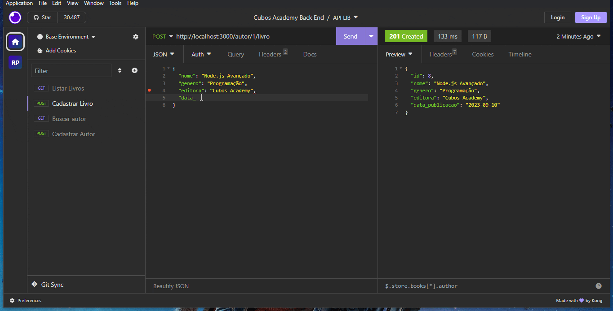

# API para Sistema Bibliotecário

## Descrição do projeto 🎯

API responsável por realizar listagem, consulta e cadastro de livros e autores no banco de dados da biblioteca.

  

## Funcionalidades 🛠

- [x] Cadastro de autor
- [x] Busca de autor pelo id
- [x] Cadastro de livro
- [x] listagem de livros
- [ ] busca de livro pelo id
- [ ] listagem de autores

## Como executar o projeto ⚙

- Clone o repositório:

```
 git clone https://github.com/RebecaBNunes API-Biblioteca.git
```

- Navege até a pasta do projeto e instale as dependencias necessárias: (express, nodemon e pg):

```
npm install
```

- Execute o script de inicialização:

```
npm run start
```

## Exemplo de Uso 🎬

Para executar requisições à API, instale um cliente HTTP (exemplo: [Insomnia](https://insomnia.rest/download))

No gif abaixo, é possível ver o cadastro de um livro para um autor e a listagem dos livros já cadastrados.



## Autora 🧚‍♂️


<p>Rebeca Barbosa 🐱‍💻</p>
<a href="mailto:beca9375@gmail.com">📩 Entre em contato</a>

###### tags: `node` `lógica` `banco de dados` `sql` `postgres`
